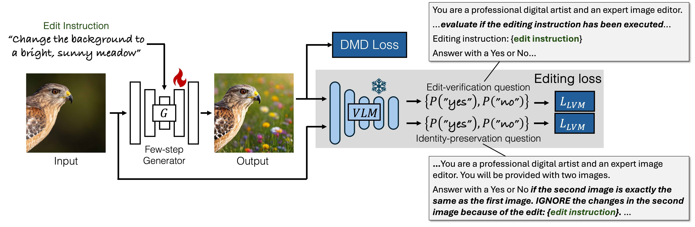

# NP-Edit

> *This is an unofficial reimplementation of NP-Edit.


<br>

***Learning an Image Editing Model without Image Editing Pairs*** (ICLR 2026)

[Nupur Kumari](https://nupurkmr9.github.io/),
[Sheng-Yu Wang](https://sheng-yu.github.io/),
[Nanxuan Zhao](https://nxzhao.com/),
[Yotam Nitzan](https://yotamnitzan.github.io/),
[Yuheng Li](https://yuheng-li.github.io/),
[Krishna Kumar Singh](https://krsingh.cs.ucdavis.edu/),
[Richard Zhang](https://richzhang.github.io/),
[Eli Shechtman](https://research.adobe.com/person/eli-shechtman/),
[Jun-Yan Zhu](https://www.cs.cmu.edu/~junyanz/),
[Xun Huang](https://xunh.io/)
 
### [website](https://nupurkmr9.github.io/npedit/) | [paper](https://arxiv.org/abs/2510.14978) | [Code](https://github.com/nupurkmr9/npedit) 

## Differences from the Paper Implementation

This repo is a reimplementation intended to be fully reproducible from open-source components. It deviates from the paper in the following ways:

- **Base text-to-image model:** [Z-Image (6B)](https://huggingface.co/Tongyi-MAI/Z-Image) instead of the internal 2B DiT latent diffusion model used in the paper.
- **VLM critic:** InternVL3-14B instead of LLaVA-OneVision-7B as the VLM. 
- **Training data:** open-source [pico-banana-400k](https://github.com/apple/pico-banana-400k) + [GPT-Image-Edit-1.5M](https://huggingface.co/datasets/UCSC-VLAA/GPT-Image-Edit-1.5M) (only reference images and edit instructions are used during training). The paper used an internal collection of reference images with instructions synthesized by Qwen2.5-32B.

## Method


<p align="center">
  
</p>

We present a training paradigm that eliminates the need for paired data to train image editing models. Our approach directly fine-tunes a diffusion model into a few-step editing model by unrolling it during training and leveraging feedback from vision-language models (VLMs). A distribution matching loss ensures visual fidelity by constraining outputs to remain within the image manifold of pretrained models.


## Qualitative Comparison (from Paper)


* For local-image editing:
<p align="center">

</p>

* For free-form subject reference image based editing:
<p align="center">

</p>


## Setup

**Requirements:** NVIDIA GPUs (H200/H100 recommended, tested on H200), Linux, Python 3.9+

```bash
# Install dependencies
pip3 install torch torchvision
pip install --pre flash-attn-4[cu13]
pip install transformers==5.5.0
pip install accelerate diffusers
pip install wandb peft datasets timm
pip install "huggingface_hub[cli]"
```

## Inference with Trained Model

Download the pretrained checkpoint:

```bash
hf download nupurkmr9/npedit zimage_npedit_internvl.pt --local-dir experiments/
```

```
python scripts/edit.py --image assets/input.jpg --instruction "Delete the white fence." --output assets/out.jpg
```


## Environment Variables

The following environment variables are read by configs and training scripts. Set them before launching training or inference:

| Variable | Required for | Purpose |
|----------|--------------|---------|
| `HF_TOKEN` | Training & inference | Authenticates with HuggingFace to download the Z-Image base model and InternVL critic. |
| `WANDB_ENTITY` | Training (if `wandb_mode: online`) | W&B team/user the run logs to. Referenced as `${WANDB_ENTITY}` in the training configs. |
| `WANDB_API_KEY` | Training (if `wandb_mode: online`) | W&B auth. Alternative: run `wandb login` once. |

```bash
export HF_TOKEN="hf_..."
export WANDB_ENTITY="your-wandb-username-or-team"
export WANDB_API_KEY="..."   # or: wandb login
```

To disable W&B logging entirely, set `wandb_mode: disabled` in the config — `WANDB_ENTITY` / `WANDB_API_KEY` are then not needed.

## Dataset Setup

We train on a combination of [pico-banana-400k](https://github.com/apple/pico-banana-400k) and [GPT-Image-Edit-1.5M](https://huggingface.co/datasets/UCSC-VLAA/GPT-Image-Edit-1.5M). Use the provided download script:

**Prerequisites:**

The download script requires [GNU Parallel](https://www.gnu.org/software/parallel/) and [AWS CLI](https://docs.aws.amazon.com/cli/latest/userguide/getting-started-install.html) (for pico-banana source images from Open Images S3).

```bash
# Install GNU Parallel (if not available via your package manager)
wget https://ftpmirror.gnu.org/parallel/parallel-latest.tar.bz2
tar -xjf parallel-latest.tar.bz2 && cd parallel-*
./configure --prefix=$HOME/.local && make && make install
export PATH="$HOME/.local/bin:$PATH"

# Install AWS CLI (no credentials needed — downloads use --no-sign-request)
curl "https://awscli.amazonaws.com/awscli-exe-linux-x86_64.zip" -o "awscliv2.zip"
unzip awscliv2.zip && ./aws/install --install-dir $HOME/.local/aws-cli --bin-dir $HOME/.local/bin
```


Download `merged_edit_data.json` (the list of valid samples used during training):

```bash
hf download nupurkmr9/npedit merged_edit_data.json --local-dir ./datasets
```

Then download the image datasets:

```bash
bash scripts/download_datasets.sh --data-dir ./datasets
```

This will:
1. Download **pico-banana-400k** source images from Open Images S3 (requires AWS CLI)
2. Download **GPT-Image-Edit-1.5M** from HuggingFace using multi-process download
3. We use the samples listed in `merged_edit_data.json` to select valid samples

**Options:**
```bash
bash scripts/download_datasets.sh --data-dir ./datasets \
    --workers 8 \              # parallel download workers (default: 8)
    --skip-gpt-image \         # skip GPT-Image-Edit-1.5M
    --skip-pico-banana \       # skip pico-banana-400k
```

## Training

We use a student-teacher distillation setup with a VLM critic. The default config uses Z-Image as the base model and InternVL3-14B as the critic:

Warmup stage to train the model to copy reference images as output
```bash
torchrun --nnodes=1 --nproc_per_node=8 --node_rank=0 \
    --master_addr=localhost --master_port=9997 \
    -m entrypoint --mode=train --config configs/zimage_instruct_refcopy.yaml
```

Final training with VLM and DMD loss
```bash
torchrun --nnodes=1 --nproc_per_node=8 --node_rank=0 \
    --master_addr=localhost --master_port=9997 \
    -m entrypoint --mode=train --config configs/zimage_instruct_critic_internvl.yaml
```

For multi-node training, run the above command on each node with the appropriate `WORLD_SIZE`, `NUM_GPUS`, `NODE_RANK`, and `MASTER_ADDR` set.


**Key config parameters** (in `configs/zimage_instruct_critic_internvl.yaml`):

| Parameter | Description | Default |
|-----------|-------------|---------|
| `shard_size` | FSDP sharding size (must divide total GPU count) | null (sets to total GPU count) |
| `critic_loss_weight` | Weight for VLM critic loss | 0.02 |
| `dmd_loss_weight` | Weight for distribution matching loss | 1.0 |
| `max_lr` | Learning rate | 2e-5 |
| `lora_rank` | LoRA rank (0 = full fine-tuning) | 0 (by default) |
| `batch_size` | Per-GPU batch size | 1 |
| `bucketize` | Enable resolution bucketing for variable aspect ratios | true |
| `resolution_buckets` | List of (H, W) buckets, e.g. 512x512, 576x448, 640x384 | 7 buckets |


## Inference on GEdit Bench (After training)

```bash
torchrun --nproc_per_node=1   -m entrypoint --mode=inference --config configs/zimage_inference.yaml
```

Inference parameters are set in the `inferencer` section of the config:

## Acknowledgements

- [minFM](https://github.com/Kai-46/minFM/) — the base training framework this project builds upon
- [Z-Image](https://huggingface.co/Tongyi-MAI/Z-Image) — base text-to-image model
- [InternVL](https://github.com/OpenGVLab/InternVL) — VLM used as critic
- [pico-banana-400k](https://github.com/apple/pico-banana-400k) and [GPT-Image-Edit-1.5M](https://huggingface.co/datasets/UCSC-VLAA/GPT-Image-Edit-1.5M) — training datasets. We only use the reference input image and edit instruction during our training. 

## TODO

- [x] Optimize for H100. Gradient checkpointing works correctly.
- [ ] Check performance with LoRA instead of full fine-tuning for lower VRAM.
- [ ] Add the free-form subject-reference customization experiment.

## BibTeX

```bibtex
@inproceedings{kumari2025npedit,
  title={Learning an Image Editing Model without Image Editing Pairs},
  author={Kumari, Nupur and Wang, Sheng-Yu and Zhao, Nanxuan and Nitzan, Yotam and Li, Yuheng and Singh, Krishna Kumar and Zhang, Richard and Shechtman, Eli and Zhu, Jun-Yan and Huang, Xun},
  booktitle={ICLR},
  year={2026}
}
```
